# SA_Somativa_Auth
DOCUMENTAÇÃO DO PROJETO RH:

<!-- Imagens com nomes acima e fonte menor usando HTML para garantir estilo no GitHub -->

<strong>DIAGRAMA DE CLASSES DE USO:</strong> 
<em style="font-size:12px;">Isabela Ramos</em>

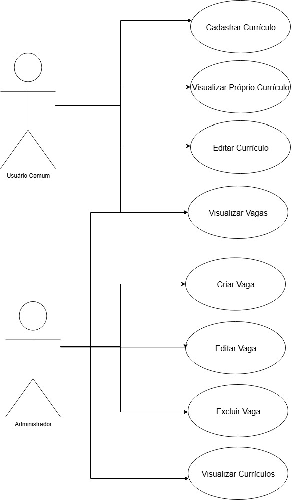

<strong>FLUXOGRAMA:</strong> 
<em style="font-size:12px;">Enzo Paralupi</em>

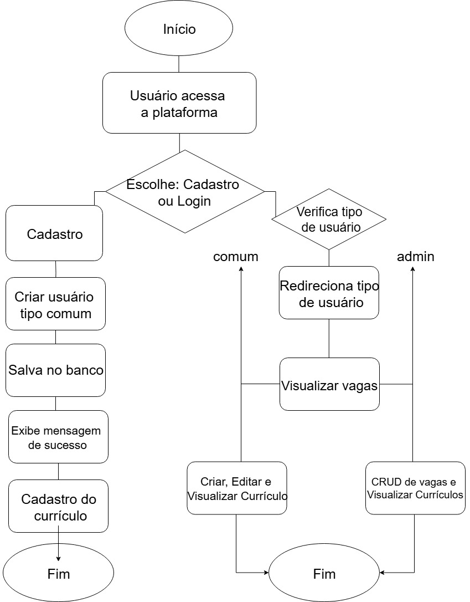

<strong>DIAGRAMA DE CLASSES:</strong> 
<em style="font-size:12px;">Kauan Sabino</em>

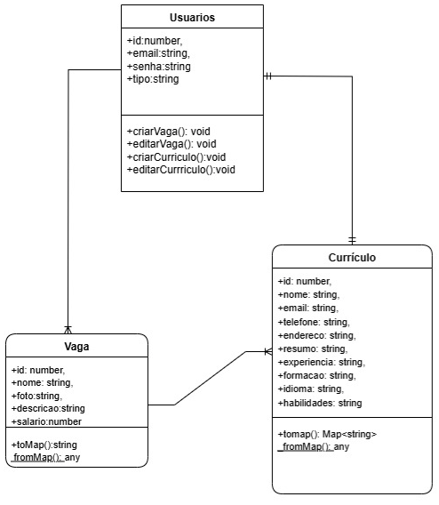

<strong>CRONOGRAMA:</strong> 
<em style="font-size:12px;">Kauã Santos</em>

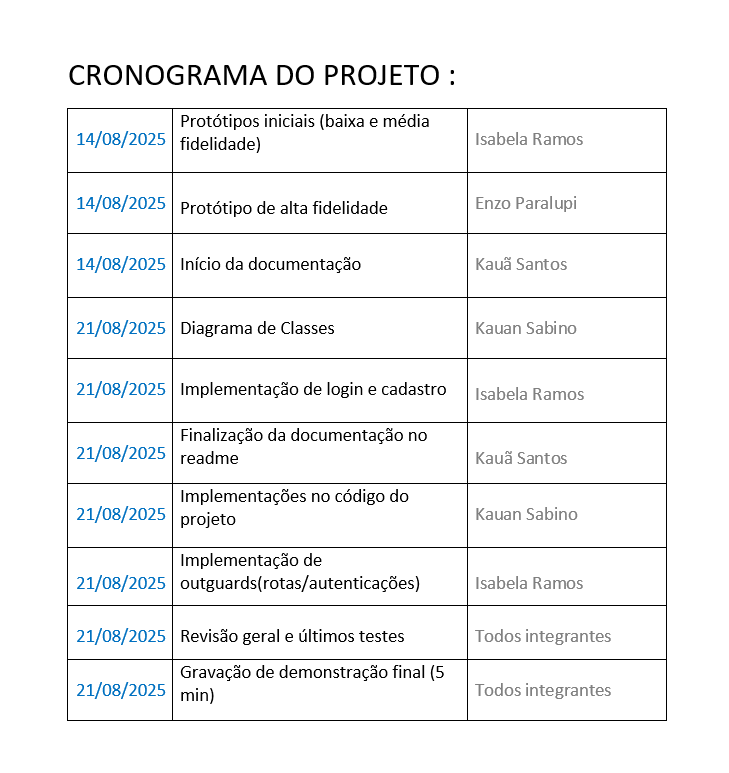

<small>

1.ESCOPO:  
1. Objetivo do Projeto RH  
O objetivo do projeto RH é desenvolver uma aplicação web de RH que permita um tipo de interação entre os usuários comuns e administradores. A plataforma criada oferecerá as funcionalidades como cadastro e login de usuários, criação e visualização de currículos, bem como a gestão de vagas por parte do administrador do projeto no final.  
2. Perfis de Usuário  
2.1- Usuário Comum:  
-Pode criar uma conta na plataforma.  
-Pode realizar login utilizando e-mail e senha.  
-Pode cadastrar, editar e visualizar seu próprio currículo.  
-Pode visualizar todas as vagas disponíveis na plataforma, cadastradas pelo administrador.  
2.2- Administrador (RH):  
-Possui acesso restrito através de login.  
-Pode cadastrar, editar e excluir vagas de empregos dos usuários comuns.  
-Pode visualizar todos os currículos cadastrados pelos usuários comuns.  
3. Funcionalidades Requeridas do Projeto  
3.1- Funcionalidades do Usuário Comum  
Cadastro de Conta:  
O usuário poderá criar uma conta informando nome completo, e-mail e senha.  
Login:  
O acesso será feito via e-mail e senha cadastrados pelo usuário.  
Cadastro e Edição de Currículo:  
O usuário poderá preencher e manter atualizado um currículo contendo 

:  
-Nome completo  
-E-mail  
-Telefone  
-Endereço  
-Experiência profissional  
-Formação acadêmica  
-Idiomas  
-Habilidades  
Visualização de Vagas:  
O usuário poderá visualizar a listagem de todas as vagas ativas da plataforma, com informações como:  
-Nome da vaga  
-Foto  
-Descrição da Vaga  
-Salário  
3.2- Funcionalidades do Administrador  
Login:  
O administrador acessará a área de gestão por meio de login com credenciais específicas.  
Cadastro de Vagas:  
O administrador poderá criar vagas com os seguintes campos:  
-Título da vaga  
-Descrição  
-Requisitos  
-Tipo de contrato  
-Localização  
Edição e Exclusão de Vagas:  
As vagas cadastradas poderão ser editadas ou removidas conforme necessário.  
Visualização de Currículos:  
O administrador terá acesso aos currículos cadastrados pelos usuários comuns, podendo visualizá-los em detalhes.  

2.OBJETIVO SMART:  
S – ESPECÍFICO : O projeto consiste no desenvolvimento de uma aplicação web de RH que permita o cadastro e login de dois tipos de usuários: o usuário comum (candidato) e o administrador (RH). O usuário comum poderá cadastrar, editar e visualizar seu próprio currículo, além de visualizar as vagas disponíveis na plataforma. Já o administrador terá acesso ao cadastro, edição e exclusão de vagas, bem como à visualização de currículos enviados pelos candidatos.  
M – MENSURÁVEL : O sucesso do projeto será medido pela implementação completa das funcionalidades previstas: autenticação de usuários, sistema de gerenciamento de currículos e gerenciamento de vagas. O objetivo será considerado alcançado quando todas essas funcionalidades estiverem ativas e funcionando corretamente, com pelo menos um usuário de cada tipo conseguindo realizar todas as ações previstas para seu perfil.  
A – ALCANÇÁVEL : O escopo do projeto foi definido de forma realista e compatível com os recursos disponíveis. As funcionalidades são básicas e viáveis de serem implementadas com as tecnologias web atuais, como React, Node.js, e bancos de dados relacionais ou não-relacionais. O projeto pode ser desenvolvido por uma única pessoa ou uma pequena equipe em um prazo determinado.  
R – RELEVANTE : A aplicação atende a uma necessidade real de organização e digitalização do processo seletivo em pequenas e médias empresas, facilitando tanto a gestão de vagas pelo RH quanto o envio de currículos pelos candidatos. Isso torna o projeto útil e relevante para o mercado de trabalho atual.  
T – TEMPORAL : O projeto será desenvolvido e entregue em um prazo de até 2 semanas, um prazo que garante ao mesmo tempo: foco, organização e cumprimento das metas dentro de um cronograma definido.  

3.LEVANTAMENTO DE REQUISITOS:  
1. Requisitos Funcionais:  
1.1 Cadastro e Login  
– Cadastro de usuário comum:  
O sistema deve permitir que o usuário comum (candidato) se registre informando nome completo, e-mail e senha.  
 – Login de usuário comum:  
O sistema deve permitir que o usuário comum realize login com e-mail e senha cadastrados.  
 – Login de administrador:  
O administrador deve ser capaz de fazer login com e-mail e senha.  
1.2 Gestão de Currículos (Usuário Comum)  
 – Cadastro de currículo:  
O usuário comum pode criar um currículo com campos obrigatórios, como nome, telefone, endereço, e-mail, experiência profissional, formação acadêmica e competências.  
– Edição de currículo:  
O usuário comum pode editar seu currículo a qualquer momento após o cadastro.  
– Visualização do próprio currículo:  
O usuário comum pode visualizar seu currículo a qualquer momento.  
1.3 Gestão de Vagas (Administrador)  
– Cadastro de vaga:  
O administrador pode cadastrar novas vagas informando título, descrição, requisitos, tipo de contrato e salário.  
 – Edição de vaga:  
O administrador pode editar informações de uma vaga já cadastrada.  
 – Exclusão de vaga:  
O administrador pode excluir uma vaga cadastrada.  
– Visualização de currículos:  
O administrador pode visualizar todos os currículos cadastrados pelos usuários comuns.  
1.4 Visualização de Vagas (Usuário Comum)  
– Visualização de vagas:  
O usuário comum pode visualizar todas as vagas ativas cadastradas pelo administrador.  
________________________________________  
2. Requisitos Não-Funcionais:  
2.1 Usabilidade  
– Interface amigável e responsiva:  
A interface deve ser intuitiva e funcionar bem em dispositivos móveis e desktop, garantindo uma experiência fluida ao usuário.  
2.2 Desempenho  
– Tempo de resposta:  
O tempo de resposta para qualquer requisição do usuário (login, cadastro, visualização) não deve ultrapassar 3 segundos.  
2.3 Segurança  
 – Armazenamento seguro de senhas:  
As senhas dos usuários devem ser armazenadas de forma segura, utilizando técnicas como hash (bcrypt ou argon2).  
– Proteção contra SQL Injection e XSS:  
A aplicação deve ser protegida contra ataques comuns como SQL Injection e Cross-Site Scripting (XSS).  
– Autenticação e controle de acesso:  
O sistema deve garantir que usuários comuns não tenham acesso a funcionalidades exclusivas do administrador, utilizando controle de permissões.  
2.4 Escalabilidade  
 – Escalabilidade da aplicação:  
A plataforma deve ser capaz de suportar um número crescente de usuários sem degradação significativa do desempenho.  
2.5 Manutenibilidade  
– Código bem estruturado e documentado:  
O código deve ser bem estruturado e documentado para facilitar a manutenção e futuras implementações.  
2.6 Disponibilidade  
 – Alta disponibilidade:  
A plataforma deve ter uma disponibilidade mínima de 99% durante o mês.  
________________________________________  
3. Recursos Humanos:  
3.1 Desenvolvedor Full-Stack (1 a 2 profissionais)  
•	Responsabilidades:  
o	Desenvolvimento da aplicação tanto no front-end quanto no back-end.  
o	Implementação das funcionalidades de login, cadastro, visualização de vagas e currículos.  
o	Integração com banco de dados.  
o	Testes da aplicação.  
3.2 Designer UI/UX (1 profissional, opcional)  
•	Responsabilidades:  
o	Criação do layout da aplicação.  
o	Garantia de uma experiência de usuário intuitiva e agradável.  
o	Responsividade para que a aplicação funcione bem em dispositivos móveis e desktops.  
3.3 Gerente de Projeto (1 profissional, opcional)  
•	Responsabilidades:  
o	Planejamento do projeto.  
o	Acompanhamento do cronograma e entrega das etapas do projeto.  
o	Coordenação da equipe e comunicação entre os membros.  
________________________________________  
4. Ferramentas Utilizadas :  
4.1 Ambiente de Desenvolvimento  
•	Visual Studio Code (VS Code)  
o	Utilizado como a principal IDE (Integrated Development Environment) para o desenvolvimento do código.  
o	Oferece suporte a uma ampla gama de extensões, como o Angular Essentials e Prettier, que facilitam a codificação com Angular, o uso de TypeScript e o formato de código automático.  
o	Integração direta com Git e GitHub, permitindo commits, push/pull e gerenciamento de branches diretamente da IDE.  
4.2 Framework de Desenvolvimento Front-end  
•	Angular  
o	Framework utilizado para a construção da aplicação web.  
o	Permite o desenvolvimento de Single Page Applications (SPA), onde a navegação entre páginas ocorre sem recarregar a página inteira, proporcionando uma experiência mais fluida ao usuário.  
o	Suporte para desenvolvimento modular e reutilização de componentes, além de integração com serviços para comunicação com o back-end.  
4.3 Controle de Versão  
•	Git  
o	Sistema de versionamento distribuído utilizado para gerenciar o histórico de alterações no código-fonte.  
o	Facilita a colaboração e o controle de mudanças ao longo do desenvolvimento.  
•	GitHub  
o	Plataforma de hospedagem de repositórios Git, permitindo o gerenciamento do código, a revisão de alterações e a colaboração com a equipe.  
o	Suporte para Issues, Pull Requests e Actions para integração contínua (CI).  
4.4 Banco de Dados / Armazenamento de Dados  
•	Local Storage (Navegador)  
o	Utilizado para armazenar dados temporários do usuário diretamente no navegador, como informações de sessão, preferências ou dados do currículo enquanto o usuário não está logado.  
•	Banco de Dados   
o	Banco de dados em nuvem ou simulado para armazenar dados persistentes como currículos, vagas e perfis de usuários.  
o	A comunicação entre o front-end (Angular) e o banco de dados é feita via API REST.  

</small>

FIGMA: 

<strong>PÁGINA DE REGISTRO:</strong> 
<em style="font-size:12px;"></em>

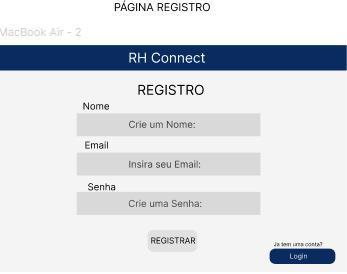

<strong>PÁGINA DE LOGIN:</strong> 
<em style="font-size:12px;"></em>

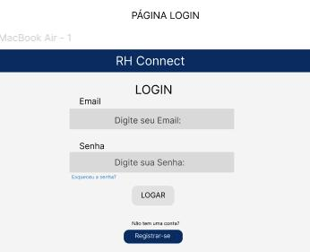

<strong>PÁGINA INICIAL:</strong> 
<em style="font-size:12px;"></em>

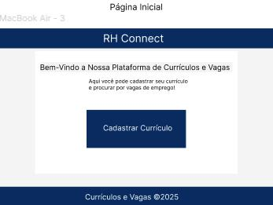

<strong>PÁGINA DE VAGAS:</strong> 
<em style="font-size:12px;"></em>

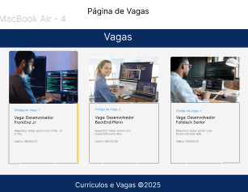

<strong>CRIAÇÃO DE CURRÍCULOS:</strong> 
<em style="font-size:12px;"></em>

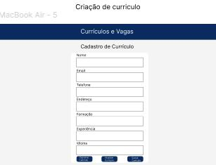

<strong>CRIAÇÃO DE VAGAS:</strong> 
<em style="font-size:12px;"></em>

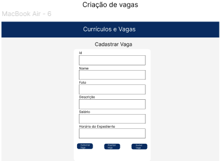

<strong>ADMINISTRAÇÃO DE VAGAS:</strong> 
<em style="font-size:12px;"></em>

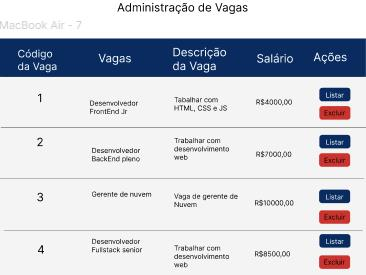